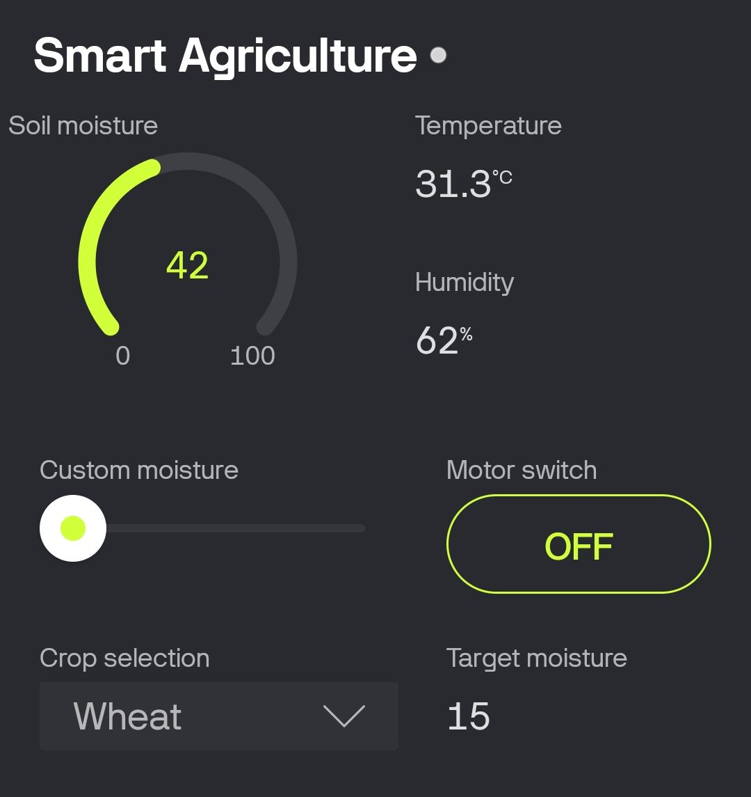
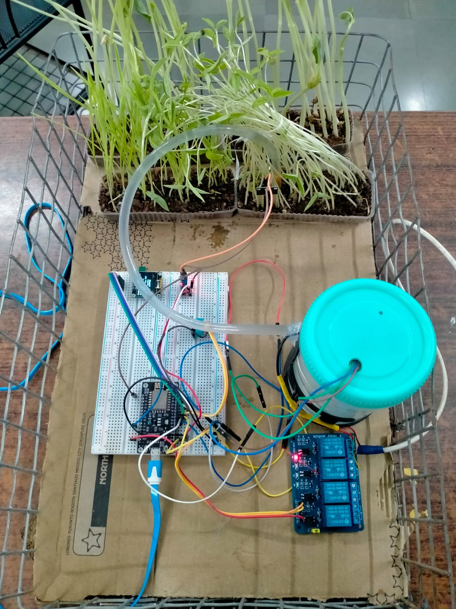
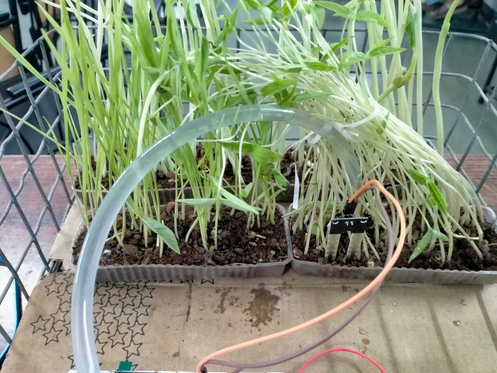
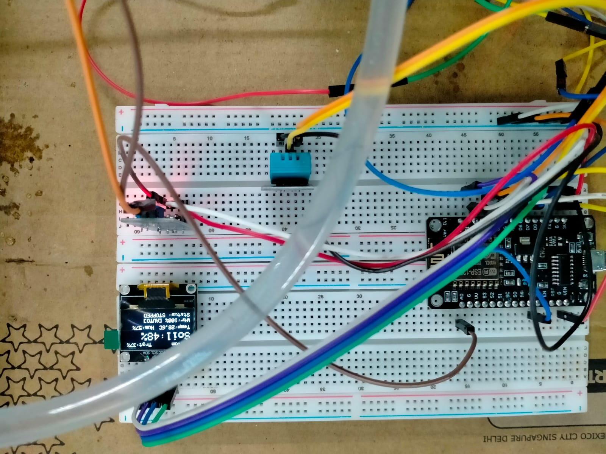
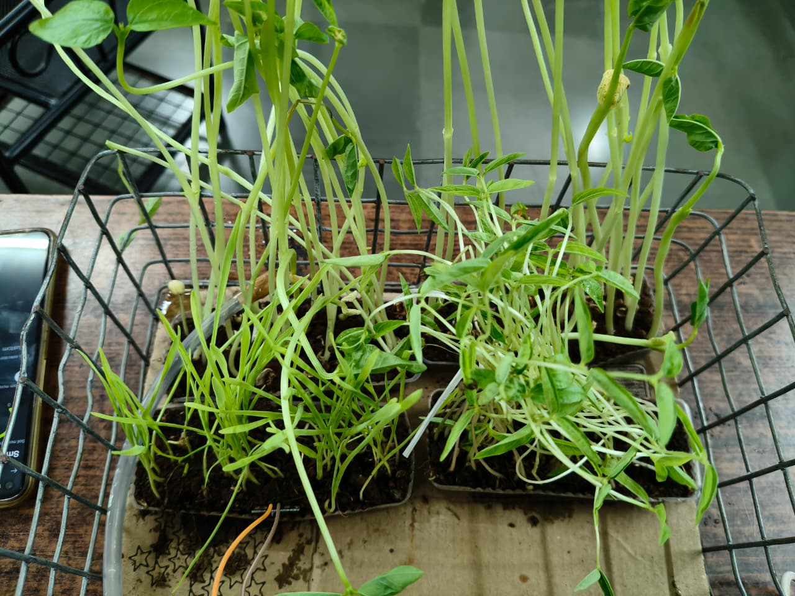
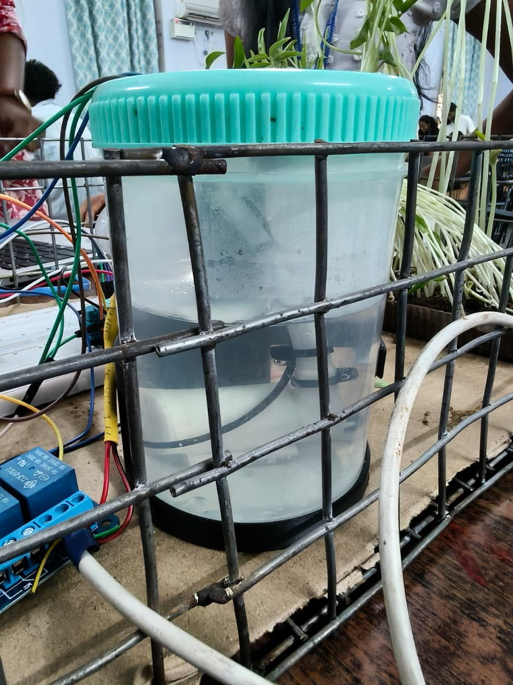

<div align="center">
  
</div>

<br>

This project is a comprehensive **Smart Agriculture IoT System** built using the ESP8266 microcontroller and the Blynk platform. It continuously monitors environmental and soil parameters, provides automated and manual water pump control based on selected crop needs, and ensures the safety of the hardware by preventing the pump from running dry.

## 🌟 Features

- **Real-Time Monitoring**: Tracks soil moisture, environmental temperature, and humidity continuously.
- **Crop-Based Smart Irrigation**: The core feature of this system is its crop-specific watering intelligence. It automatically controls the water pump based on the specific moisture thresholds required by different crops.
- **Automatic Moisture Maintenance**: When the soil moisture drops below the critical level suitable for the selected crop, the pump automatically starts. Once the moisture reaches the desired optimal level, it automatically stops—maintaining a perfect environment for that specific crop without human intervention.
- **Predefined Crop Profiles**: Choose from built-in profiles (Wheat, Moong, Brown Cowpea, White Cowpea) with preset optimal moisture thresholds.
- **Custom Mode**: Manually set a target moisture threshold using a slider in the Blynk app for unlisted crops.
- **Auto/Manual Override**: Switch between automated crop-based irrigation or manual pump control via the app.
- **Hardware Safety**: Monitors the water tank level using an ultrasonic sensor. The pump is automatically disabled if the water level falls below a critical threshold (25%) to prevent motor dry-running.
- **Local Display**: View real-time statistics, selected crop, target threshold, and pump status on a 128x64 OLED display.
- **Cloud Dashboard**: Full remote monitoring and control using the Blynk IoT platform.

## 🛠️ Hardware Requirements

- **Microcontroller**: ESP8266 (e.g., NodeMCU or Wemos D1 Mini)
- **Sensors**:
  - DHT11 (Temperature & Humidity Sensor)
  - Analog Soil Moisture Sensor
  - HC-SR04 Ultrasonic Sensor (for water tank level)
- **Display**: 0.96" I2C OLED Display (SSD1306, 128x64)
- **Actuator**: 5V Relay Module & Submersible Water Pump
- Jumper wires & Breadboard
- Power supply for ESP8266 and the Water Pump

## 🔌 Pin Connections

| Component | ESP8266 Pin | Notes |
| :--- | :--- | :--- |
| **DHT11 Sensor** | GPIO 2 (D4) | Requires a pull-up resistor (often built into the module) |
| **Soil Moisture** | A0 (Analog) | Reads raw analog values (Dry: ~1024, Wet: ~400) |
| **Relay Module**| GPIO 14 (D5)| Controls the water pump (Active HIGH) |
| **Ultrasonic Trig**| GPIO 12 (D6)| Trigger pin for HC-SR04 |
| **Ultrasonic Echo**| GPIO 13 (D7)| Echo pin for HC-SR04 |
| **OLED SDA** | SDA Pin | Usually GPIO 4 (D2) on NodeMCU |
| **OLED SCL** | SCL Pin | Usually GPIO 5 (D1) on NodeMCU |

## 🧩 Circuit Explanation

The circuit is designed to act as a complete standalone IoT agricultural node:
1. **The Brain (ESP8266)**: Acts as the central controller, gathering data from all sensors via analog and digital pins, and communicating with the Blynk cloud over WiFi.
2. **Moisture Sensing (Analog Input)**: The Soil Moisture Sensor is connected to the `A0` analog pin. It measures the resistance in the soil (more water = lower resistance). The ESP8266 maps this raw 0-1024 value into a 0-100% moisture reading.
3. **Environmental Sensing (Digital Input)**: The DHT11 sensor uses a single digital pin (`D4`) to send multiplexed temperature and humidity data to the ESP8266.
4. **Water Level Sensing (Ultrasonic)**: The HC-SR04 uses two pins (`D6` for Trig, `D7` for Echo). The ESP8266 sends a sound pulse and measures the time it takes to bounce back from the water surface, calculating the exact volume/level of water remaining in the tank.
5. **Actuation (Relay & Pump)**: A 5V Relay module is connected to `D5`. Since the ESP8266's GPIOs cannot provide enough current to drive a water pump directly, the ESP8266 sends a low-current control signal to the Relay. The Relay acts as an electronic switch, completing the high-current circuit for the water pump when triggered.
6. **Local Feedback (OLED)**: The SSD1306 OLED display is connected via the I2C bus (`SDA` and `SCL`), allowing it to receive and draw text displaying all system metrics in real-time.

## 📚 Required Libraries

Make sure to install the following libraries in your Arduino IDE via the Library Manager (`Sketch > Include Library > Manage Libraries...`):

1. `Blynk` by Volodymyr Shymanskyy
2. `Adafruit GFX Library` by Adafruit
3. `Adafruit SSD1306` by Adafruit
4. `DHT sensor library` by Adafruit (also requires `Adafruit Unified Sensor`)

## 📱 Blynk App Configuration

Create a new project in your Blynk IoT Dashboard and configure the Datastreams as follows:

| Virtual Pin | Data Type | Description |
| :---: | :--- | :--- |
| **V0** | Integer | Soil Moisture (%) |
| **V1** | Double/Float | Temperature (°C) |
| **V2** | Double/Float | Humidity (%) |
| **V3** | Integer | Pump Switch (0 = Off, 1 = On) / Manual Override |
| **V4** | Integer | Manual Threshold Slider (0-100) |
| **V5** | Integer | Crop Selection Menu (0=Wheat, 1=Moong, 2=Brown Cowpea, 3=White Cowpea, 4=Custom) |
| **V6** | Integer | Target Crop Threshold (%) |
| **V7** | String | Current Crop Name |
| **V8** | Integer | Water Tank Level (%) |

## 🚀 Setup & Installation

1. **Clone or Download** this repository.
2. Open `Program.ino` in the Arduino IDE.
3. Update the Blynk credentials at the top of the file with your specific Template ID, Name, and Auth Token:
   ```cpp
   #define BLYNK_TEMPLATE_ID "Your_Template_ID"
   #define BLYNK_TEMPLATE_NAME "Your_Template_Name"
   #define BLYNK_AUTH_TOKEN "Your_Auth_Token"
   ```
4. Update your WiFi credentials:
   ```cpp
   char ssid[] = "Your_WiFi_SSID";
   char pass[] = "Your_WiFi_PASSWORD";
   ```
5. **Calibrate Sensors**:
   - Depending on your soil sensor and tank dimensions, you may need to adjust the calibration values:
     ```cpp
     const int DRY_VALUE = 1024; // Raw analog value when completely dry
     const int WET_VALUE = 400;  // Raw analog value when submerged in water
     const int BOTTLE_EMPTY = 10; // Distance (cm) when tank is empty
     const int BOTTLE_FULL = 2;   // Distance (cm) when tank is full
     ```
6. Select your ESP8266 board and correct COM port in the Arduino IDE.
7. Click **Upload** to flash the code to your ESP8266.

## 📷 Project Gallery

Here are some images of the hardware setup and outputs.

<div align="center">
  
  
  
  <br><br>
  
  
  
</div>

## 🧠 How it Works (Logic)

The system runs an update cycle every 2 seconds:
1. **Reads Sensors**: Gathers analog soil data, reads DHT11 temp/humidity, and pings the ultrasonic sensor for tank level.
2. **Evaluates Mode**:
   - If **Manual Mode** is active, it adheres to the user's manual pump switch (V3).
   - If **Auto Mode** is active, it checks if the current `Soil Moisture %` is less than the `Target Crop Threshold`.
3. **Safety Check**: Regardless of the mode, if the `Water Level %` is less than 25%, the pump is forcefully disabled.
4. **Actuation**: Triggers the relay (pump) based on the final evaluated logic.
5. **Update UI**: Refreshes the local OLED display and sends the updated datastreams to the Blynk cloud.

---

<div align="center">
  <h3>🌱 Cultivating the future with IoT and Automation</h3>
  
  
  
  <p><i>Designed for efficient, remote-controlled farming.</i></p>
</div>
